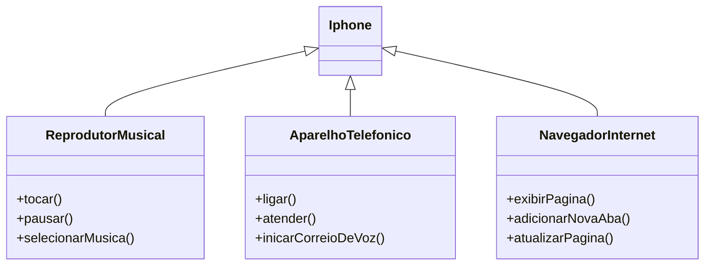

# Modelando Iphone com UML
Desafio proposto pela DIO (Digital Innovation One) durante o bootcamp GFT - Desenvolvimento Java com IA

## Modelagem e Diagramação de um Componente iPhone
Neste desafio, o objetivo era modelar e diagramar a representação UML do componente iPhone, abrangendo suas funcionalidades como Reprodutor Musical, Aparelho Telefônico e Navegador na Internet.

#### Contexto
Com base no vídeo de lançamento do iPhone de 2007 (link abaixo), deve-se elaborar a diagramação das classes e interfaces utilizando uma ferramenta UML qualquer. Em seguida, implementar as classes e interfaces no formato de arquivos `.java`.

[Lançamento iPhone 2007](https://www.youtube.com/watch?v=9ou608QQRq8)
- Minutos relevantes: 00:15 até 00:55

#### Funcionalidades a Modelar
1. **Reprodutor Musical (ReprodutorMusical)**
   - Métodos: `tocar()`, `pausar()`, `selecionarMusica()`
2. **Aparelho Telefônico(AparelhoTelefonico)**
   - Métodos: `ligar()`, `atender()`, `iniciarCorreioDeVoz()`
3. **Navegador na Internet(NavegadorInternet)**
   - Métodos: `exibirPagina()`, `adicionarNovaAba()`, `atualizarPagina()`

## Modelo UML

